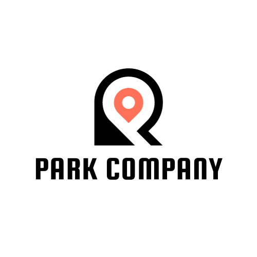

<!-- Top with logo and project name -->

  
  ParkCo Website Redesign

## Project Overview

The ParkCo Website Redesign was a team-based Software Engineering course project aimed at modernizing the public-facing parking platform to improve responsiveness, usability, and user engagement. The redesigned site delivers a clean, mobile-friendly experience with enhanced search, filtering, and informational components for parking facilities.

## My Role

**UI/UX Designer & Collaborative Contributor**  
- Created responsive wireframes for desktop, tablet, and mobile breakpoints.  
- Defined layout, user flows, and visual hierarchy to align with business requirements.  
- Styled and annotated design mockups using Figma and Adobe Photoshop for brand cohesion and color consistency.  
- Worked closely with developers to ensure fidelity between design and implementation.  
- Incorporated feedback from stakeholder-style requirements to iterate on usability and content placement.

## Problem Area

Software Engineering & Web Development — translating business requirements into a responsive, user-centered web interface that supports parking search, information discovery, and company branding.

## Key Features (Design Perspective)

- Responsive layout for desktop, tablet, and mobile.  
- Parking search and filter entry points with clear call-to-actions.  
- Dynamic results presentation with map integration.  
- Company information and testimonial sections to build trust.  
- Branding elements including custom logo and consistent color system.  
- Contact and about pages designed for clarity and accessibility.

## Wireframes

### Preview

### Full Design Spec

For the complete annotated wireframe document and additional screen flows, view the full PDF:  
**[ParkCo Wireframes (Annotated)](wireframes/parkco-wireframes.pdf)**

## Technologies & Tools

- **Design:** Figma, Adobe Photoshop  
- **Frontend (team):** HTML, CSS, JavaScript  
- **Collaboration:** Agile-style teamwork, design-to-development handoff  
- **Version Control:** Git / GitHub  

## Project Structure
<pre>
SE-Project/
├── wireframes/
│   ├── website_frame.png
│   ├── parkco-wireframes.pdf
│   └── logo.png
├── PARK/
├── Test Cases V1.md
└── README.md
  
  </pre>

## Contribution & Notes
This project was completed as part of a university Software Engineering curriculum. My primary contributions centered on user interface design, responsive layout planning, and design documentation to guide development.
